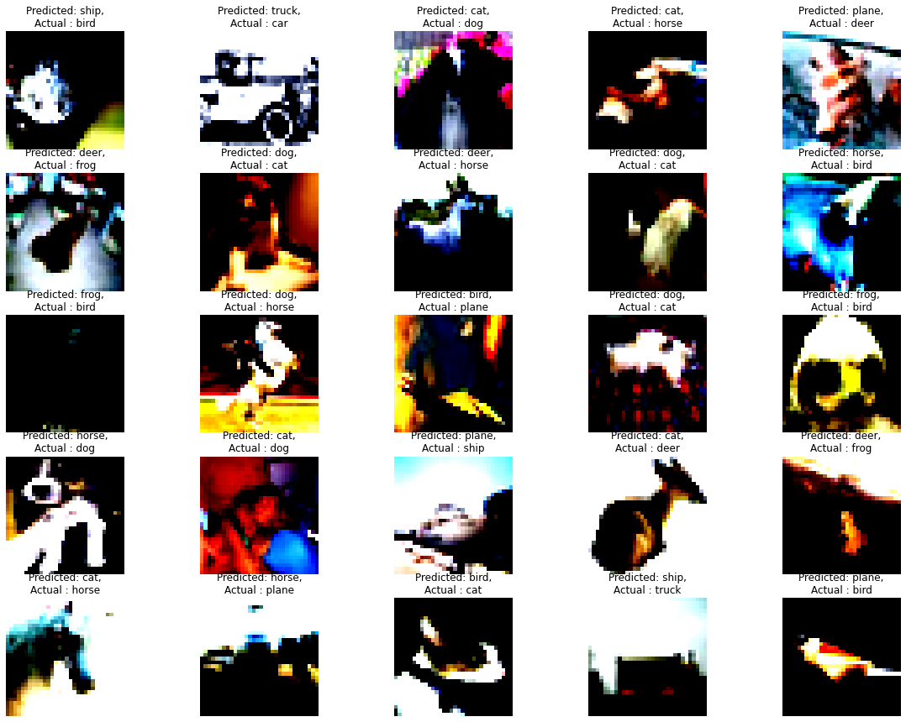

<h2 align ='center'> Assignment 10 </h2> 

### Final Training Accuracy :- 89.17%

### Transformations Used :
- Training :
    
    -  `albumentations.RandomCrop()`
    -  `albumentations.Horizontal()`
    -  `albumentations.Rotate()`
    -  `albumentations.Cutout()`
    -  `albumentations.Normalize()`
    -  `albumentations.pytorch.transforms.ToTensor()`

- Test :
    -  `albumentations.Normalize()`
    -  `albumentations.pytorch.transforms.ToTensor()`

<h2 align = 'center'> Results </h2>

<h4 align = 'center'>   Correctly Classified Images </h4>

<h4 align = 'center'>   Incorrectly Classified Images </h4>

<h4 align = 'center'>   Training and Test Accuracy </h4>

<h4 align = 'center'>   Training and Test Loss </h4>

<h2 align = 'center'> GradCAM Results </h2>

For this assignment, [pytorch_gradcam](https://pypi.org/project/pytorch-gradcam/) package was used to calculate gradients at the given layer. 

<h4 align = 'center'>   GradCAM for correctly classified images </h4>

<h4 align = 'center'>   GradCAM for incorrectly classified images </h4>

