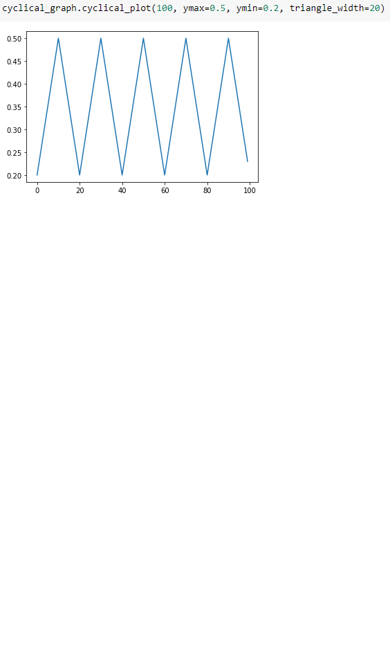
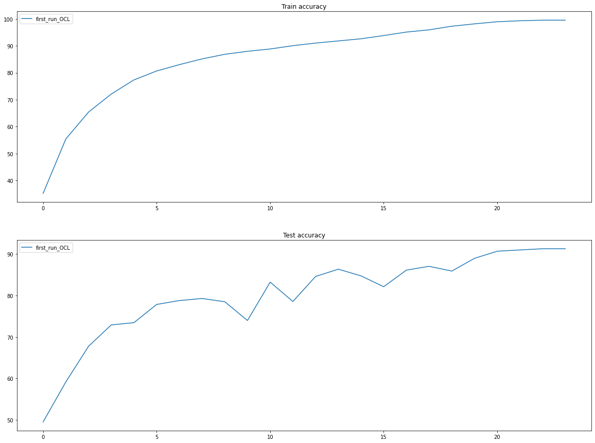

<h2 align ='center'> Assignment 11 </h2> 

<h2 align ='center'> Cyclical Graph </h2> 

```
import numpy as np
import matplotlib.pyplot as plt


def cyclical_plot(num_points, ymax, ymin, triangle_width):
    x = []
    y = []
    stepsize = triangle_width * 1.0 / 2
    for it in range(num_points):
        x.append(it)
        cycle = np.floor(1 + it / (2 * stepsize))
        xt = np.abs(it / stepsize - 2 * (cycle) + 1)
        yt = ymin + (ymax - ymin) * (1 - xt)
        y.append(yt)
    plt.plot(x, y)
    plt.show()
```
### Graph




### Final Training Accuracy :- 91.29%

### Transformations Used :
- Training :
    
    -  `albumentations.PadIfNeeded`
    -  `albumentations.RandomCrop`
    -  `albumentations.HorizontalFlip()`
    -  `albumentations.Rotate()`
    -  `albumentations.Cutout()`
    -  `albumentations.Normalize()`
    -  `albumentations.pytorch.transforms.ToTensor()`

- Test :
    -  `albumentations.Normalize()`
    -  `albumentations.pytorch.transforms.ToTensor()`

<h2 align = 'center'> Results </h2>

<h4 align = 'center'>   Accuracy Curves </h4>




<h2 align = 'center'> Model Logs </h2>

```
 0%|          | 0/98 [00:00<?, ?it/s]1 / 24
current_lr: 0.0004999999999999996
100%|██████████| 98/98 [00:34<00:00,  2.87it/s]
  5%|▌         | 1/20 [00:00<00:02,  8.68it/s] Training loss = 0.003549886168912053, Training Accuracy : 35.212
100%|██████████| 20/20 [00:02<00:00,  8.31it/s]
  0%|          | 0/98 [00:00<?, ?it/s] Test loss = 1.3925843017578126, Test Accuracy : 49.51
2 / 24
current_lr: 0.001159009742330268
100%|██████████| 98/98 [00:33<00:00,  2.90it/s]
  5%|▌         | 1/20 [00:00<00:02,  8.53it/s] Training loss = 0.0024320250377058983, Training Accuracy : 55.428
100%|██████████| 20/20 [00:02<00:00,  8.67it/s]
  0%|          | 0/98 [00:00<?, ?it/s] Test loss = 1.1524960540771485, Test Accuracy : 59.16
3 / 24
current_lr: 0.00275
100%|██████████| 98/98 [00:33<00:00,  2.89it/s]
  5%|▌         | 1/20 [00:00<00:02,  8.48it/s] Training loss = 0.0019274438964203, Training Accuracy : 65.406
100%|██████████| 20/20 [00:02<00:00,  8.50it/s]
  0%|          | 0/98 [00:00<?, ?it/s] Test loss = 0.917437857055664, Test Accuracy : 67.76
4 / 24
current_lr: 0.004340990257669732
100%|██████████| 98/98 [00:33<00:00,  2.90it/s]
  5%|▌         | 1/20 [00:00<00:02,  7.99it/s] Training loss = 0.001570757245644927, Training Accuracy : 72.102
100%|██████████| 20/20 [00:02<00:00,  8.51it/s]
  0%|          | 0/98 [00:00<?, ?it/s] Test loss = 0.7791926406860351, Test Accuracy : 72.91
5 / 24
current_lr: 0.005
100%|██████████| 98/98 [00:33<00:00,  2.89it/s]
  5%|▌         | 1/20 [00:00<00:02,  8.45it/s] Training loss = 0.0013028094545006752, Training Accuracy : 77.366
100%|██████████| 20/20 [00:02<00:00,  8.63it/s]
  0%|          | 0/98 [00:00<?, ?it/s] Test loss = 0.7545151733398437, Test Accuracy : 73.46
6 / 24
current_lr: 0.004965903599474221
100%|██████████| 98/98 [00:33<00:00,  2.88it/s]
  5%|▌         | 1/20 [00:00<00:02,  8.53it/s] Training loss = 0.0011258048471063375, Training Accuracy : 80.674
100%|██████████| 20/20 [00:02<00:00,  8.59it/s]
  0%|          | 0/98 [00:00<?, ?it/s] Test loss = 0.642323014831543, Test Accuracy : 77.85
7 / 24
current_lr: 0.004864544458820544
100%|██████████| 98/98 [00:33<00:00,  2.88it/s]
  5%|▌         | 1/20 [00:00<00:02,  8.60it/s] Training loss = 0.0009987319353967905, Training Accuracy : 83.036
100%|██████████| 20/20 [00:02<00:00,  8.33it/s]
  0%|          | 0/98 [00:00<?, ?it/s] Test loss = 0.6352622940063477, Test Accuracy : 78.79
8 / 24
current_lr: 0.0046986873911724425
100%|██████████| 98/98 [00:33<00:00,  2.90it/s]
  5%|▌         | 1/20 [00:00<00:02,  8.55it/s] Training loss = 0.0008987308829091489, Training Accuracy : 85.166
100%|██████████| 20/20 [00:02<00:00,  8.50it/s]
  0%|          | 0/98 [00:00<?, ?it/s] Test loss = 0.611501237487793, Test Accuracy : 79.29
9 / 24
current_lr: 0.004472856544978249
100%|██████████| 98/98 [00:34<00:00,  2.87it/s]
  5%|▌         | 1/20 [00:00<00:02,  8.77it/s] Training loss = 0.0008169218199327588, Training Accuracy : 86.878
100%|██████████| 20/20 [00:02<00:00,  8.43it/s]
  0%|          | 0/98 [00:00<?, ?it/s] Test loss = 0.6316714767456054, Test Accuracy : 78.51
10 / 24
current_lr: 0.004193211997025063
100%|██████████| 98/98 [00:33<00:00,  2.88it/s]
  5%|▌         | 1/20 [00:00<00:02,  8.41it/s] Training loss = 0.0007571322494186461, Training Accuracy : 87.984
100%|██████████| 20/20 [00:02<00:00,  8.56it/s]
  0%|          | 0/98 [00:00<?, ?it/s] Test loss = 0.7687679275512695, Test Accuracy : 73.98
11 / 24
current_lr: 0.0038673817216021153
100%|██████████| 98/98 [00:33<00:00,  2.88it/s]
  5%|▌         | 1/20 [00:00<00:02,  8.51it/s] Training loss = 0.0007212096243165433, Training Accuracy : 88.856
100%|██████████| 20/20 [00:02<00:00,  8.34it/s]
  0%|          | 0/98 [00:00<?, ?it/s] Test loss = 0.5094999053955078, Test Accuracy : 83.24
12 / 24
current_lr: 0.003504253519246808
100%|██████████| 98/98 [00:33<00:00,  2.89it/s]
  5%|▌         | 1/20 [00:00<00:02,  8.62it/s] Training loss = 0.0006602677167393267, Training Accuracy : 90.068
100%|██████████| 20/20 [00:02<00:00,  8.53it/s]
  0%|          | 0/98 [00:00<?, ?it/s] Test loss = 0.6133433654785156, Test Accuracy : 78.56
13 / 24
current_lr: 0.0031137325807148197
100%|██████████| 98/98 [00:33<00:00,  2.90it/s]
  5%|▌         | 1/20 [00:00<00:02,  8.64it/s] Training loss = 0.0006187044782564044, Training Accuracy : 91.052
100%|██████████| 20/20 [00:02<00:00,  8.72it/s]
  0%|          | 0/98 [00:00<?, ?it/s] Test loss = 0.4660382827758789, Test Accuracy : 84.6
14 / 24
current_lr: 0.0027064712991971946
100%|██████████| 98/98 [00:33<00:00,  2.88it/s]
  5%|▌         | 1/20 [00:00<00:02,  8.51it/s] Training loss = 0.0005823560059070587, Training Accuracy : 91.842
100%|██████████| 20/20 [00:02<00:00,  8.22it/s]
  0%|          | 0/98 [00:00<?, ?it/s] Test loss = 0.43873256912231445, Test Accuracy : 86.36
15 / 24
current_lr: 0.0022935787008028065
100%|██████████| 98/98 [00:33<00:00,  2.89it/s]
  5%|▌         | 1/20 [00:00<00:02,  8.53it/s] Training loss = 0.0005477802478708327, Training Accuracy : 92.642
100%|██████████| 20/20 [00:02<00:00,  8.55it/s]
  0%|          | 0/98 [00:00<?, ?it/s] Test loss = 0.47825174407958987, Test Accuracy : 84.75
16 / 24
current_lr: 0.0018863174192851808
100%|██████████| 98/98 [00:33<00:00,  2.89it/s]
  5%|▌         | 1/20 [00:00<00:02,  8.23it/s] Training loss = 0.0004897740436717868, Training Accuracy : 93.836
100%|██████████| 20/20 [00:02<00:00,  8.48it/s]
  0%|          | 0/98 [00:00<?, ?it/s] Test loss = 0.544297834777832, Test Accuracy : 82.13
17 / 24
current_lr: 0.0014957964807531933
100%|██████████| 98/98 [00:33<00:00,  2.89it/s]
  5%|▌         | 1/20 [00:00<00:02,  8.55it/s] Training loss = 0.0004336778074502945, Training Accuracy : 95.134
100%|██████████| 20/20 [00:02<00:00,  8.59it/s]
  0%|          | 0/98 [00:00<?, ?it/s] Test loss = 0.4411041793823242, Test Accuracy : 86.13
18 / 24
current_lr: 0.0011326682783978864
100%|██████████| 98/98 [00:33<00:00,  2.89it/s]
  5%|▌         | 1/20 [00:00<00:02,  8.48it/s] Training loss = 0.0003797373501583934, Training Accuracy : 95.966
100%|██████████| 20/20 [00:02<00:00,  8.50it/s]
  0%|          | 0/98 [00:00<?, ?it/s] Test loss = 0.4136879318237305, Test Accuracy : 87.05
19 / 24
current_lr: 0.0008068380029749386
100%|██████████| 98/98 [00:34<00:00,  2.88it/s]
  5%|▌         | 1/20 [00:00<00:02,  8.29it/s] Training loss = 0.00031169643625617027, Training Accuracy : 97.31
100%|██████████| 20/20 [00:02<00:00,  8.70it/s]
  0%|          | 0/98 [00:00<?, ?it/s] Test loss = 0.4354416259765625, Test Accuracy : 85.9
20 / 24
current_lr: 0.0005271934550217513
100%|██████████| 98/98 [00:33<00:00,  2.89it/s]
  5%|▌         | 1/20 [00:00<00:02,  8.50it/s] Training loss = 0.00025455030845478177, Training Accuracy : 98.19
100%|██████████| 20/20 [00:02<00:00,  8.55it/s]
  0%|          | 0/98 [00:00<?, ?it/s] Test loss = 0.35404316329956054, Test Accuracy : 88.98
21 / 24
current_lr: 0.00030136260882755776
100%|██████████| 98/98 [00:33<00:00,  2.90it/s]
  5%|▌         | 1/20 [00:00<00:02,  8.65it/s] Training loss = 0.00020504090934991837, Training Accuracy : 98.974
100%|██████████| 20/20 [00:02<00:00,  8.50it/s]
  0%|          | 0/98 [00:00<?, ?it/s] Test loss = 0.31283740692138673, Test Accuracy : 90.69
22 / 24
current_lr: 0.00013550554117945594
100%|██████████| 98/98 [00:33<00:00,  2.89it/s]
  5%|▌         | 1/20 [00:00<00:02,  7.93it/s] Training loss = 0.00017494156782049686, Training Accuracy : 99.338
100%|██████████| 20/20 [00:02<00:00,  8.73it/s]
  0%|          | 0/98 [00:00<?, ?it/s] Test loss = 0.30176014862060546, Test Accuracy : 91.0
23 / 24
current_lr: 3.4146400525779265e-05
100%|██████████| 98/98 [00:33<00:00,  2.89it/s]
  5%|▌         | 1/20 [00:00<00:02,  8.37it/s] Training loss = 0.0001606127480044961, Training Accuracy : 99.558
100%|██████████| 20/20 [00:02<00:00,  8.55it/s]
  0%|          | 0/98 [00:00<?, ?it/s] Test loss = 0.29707028656005857, Test Accuracy : 91.29
24 / 24
current_lr: 5e-08
100%|██████████| 98/98 [00:33<00:00,  2.90it/s]
  5%|▌         | 1/20 [00:00<00:02,  8.48it/s] Training loss = 0.00015600657206960022, Training Accuracy : 99.55
100%|██████████| 20/20 [00:02<00:00,  8.54it/s] Test loss = 0.2962520248413086, Test Accuracy : 91.29
Done!

```
