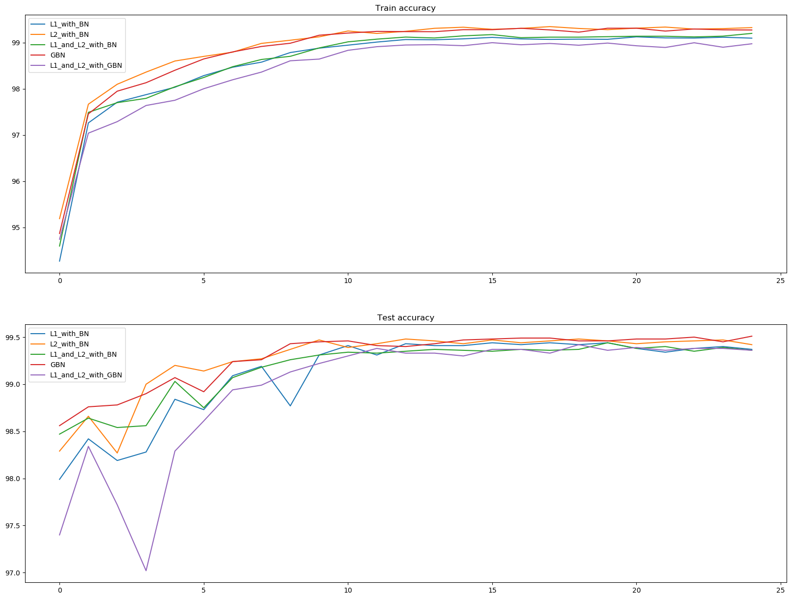
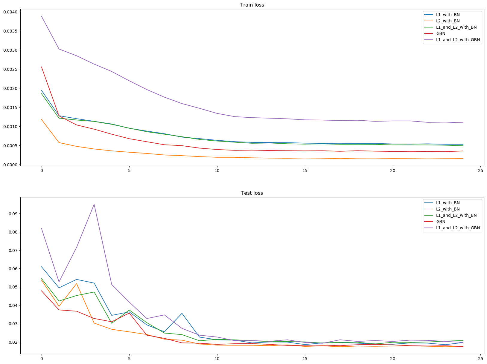
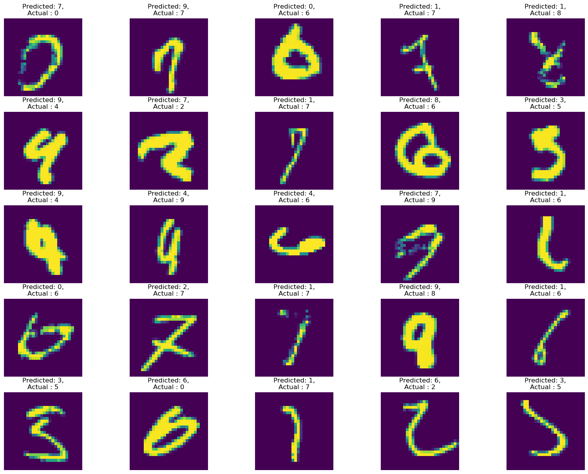

<h2 align = 'center'> Assignment </h2>

This week's assignment is to take the best assignment from last week, and experiment and observe the effect of different regularizers on the validation accuracy and loss. The following combination of regularizers were studied for this assignment :- 
* `l1` regularizer with BatchNorm layers.
* `l2` regularizer with BatchNorm layers. 
* `l1` + `l2` regularizer along with the BatchNorm layers. 
* [Ghost Batch Normalization.](https://arxiv.org/pdf/1705.08741.pdf)
* `l1` + `l2` regularizer along with Ghost Batch Normalization.  

Each trial was run for 25 epochs using constant values of `l1_lambda` and `weight_decay` throughout the training (wherever applicable), while a custom scheduler defined in the [utils.py](utils.py) file reduced the learning rate with successive epoch. 

<h2 align = 'center'> Project Structure </h2>

* [config.py](config.py) :- Contains constants used throughout the code. 
* [dataloader.py](dataloader.py) :- Contains `get_iterator` function that returns the train and test iterators for the `MNIST` dataset.
* [GhostBatchNorm.py](GhostBatchNorm.py) :- This file contains the Ghost Batch Normalization used in this assignment. The Original source code can be found [here](https://github.com/apple/ml-cifar-10-faster/blob/master/utils.py). 

* [mnist_model.py](mnist_model.py) :- Contains the best model from assignment 5, except it now accepts the `ghost_norm` parameter which replaces the BatchNorm layers in the original implementation to Ghost Batch Norm layers. 

* [train.py](train.py) :- Contains the `Trainer` and `Trial` classes, which do most of the training and evaluation heavy lifting. The `Trainer` class contains code for model training, evaluation and custom code for identifying misclassified images from the test set. The `Trial` class serves as an entry point to model which encapsulates both model training and metric tracking (using the `Record` class).

* [run.py](run.py) :- Contains the driver code for this assignment.

* [utils.py](utils.py) :- Contains miscellaneous code for generating plots for accuracy and loss metrics along with helper functions.  

<h2 align = 'center'>  Results </h2>

* From the Train and Test accuracy curves, we see that the regular `Ghost Batch Normalization` run resulted in the best test accuracy score of 99.51% . The model quickly beat the benchmark of 99.4% for the last assignment in the 6th epoch , and remained above it for the rest of the run.

* `L2 with Batch Norm` run also performed quite well, managing to reach 99.49%.

The images that were misclassified by the `Ghost Batch Normalization` reveal that the classifier has difficulty correctly classifying images which are either unclear or 'smudged' or not as well separated from the backgroud, which is to be expected. A cursory look at the incorrect predictions suggests that the inferences made by the model were within the bounds of reason. 

<h2 align = 'center'>  Analysis </h2>

### Trial 1:-
`l1` regularizer with BatchNorm layers.
- Optimizer :- Adam with initial `lr` = 0.03 and custom learning rate scheduler. 
- Loss function :- negative log likelihood loss + l1 penalty 
- Batch Size :- 128
- Regularization penalty = `5e-5` 

The `l1` + BN combination underperformed as compared to the best score in the previous assignment. The validation accuracy hovered around 99.4 after the 11th epoch.

### Trial 2:- 

`l2` regularizer with BatchNorm layers.

- Optimizer :- Adam with initial `lr` = 0.03 and custom learning rate scheduler and weight decay = `1e-5`. 
- Loss Function :- NLL loss 
- Batch Size = 128

The `l2` + BN combination outperforms the `l1` + BN combination both in the final validation accuracy score as well as the stability of the loss and accuracy metrics. 

### Trial 3 :- 

`l1` + `l2` regularizer with BatchNorm layers.
- Optimizer :- Adam with initial `lr` = 0.03 and custom learning rate scheduler and weight decay = `1e-5`.
- Loss Function :- NLL loss with `l1` penalty.
- Batch Size :- 128

The combined `l1` + `l2` + BN run performs more or less as an average of the first two trials. The model shows better stability in the validation scores as compared to `l1` + BN trial, but takes a longer as compared to `l2` + BN to cross 99.4%.

### Trial 4:- 

replacing BatchNorm layers with Ghost BatchNorm layers. 

- Optimizer = Adam with initial `lr` = 0.03 and custom learning rate scheduler.

- Loss Function :- NLL loss
- Batch Size :- 64
- num_split = 2

The Ghost BatchNorm run outperforms all the other trials in both test accuracy and loss. GBN works by splitting the batch over which the normalization statistics are calculated, and potentially improves the generalisability of the learned model. Therefore, a smaller batch size was used as compared to runs with BatchNorm. 

### Trial 5:- 

`l1` + `l2` + GhostBatchNorm layers.

- Optimizer = Adam with initial `lr` = 0.03, custom learning rate scheduler and weight decay of `1e-5`.

- Loss Function :- NLL loss with `l1` penalty. 
- Batch Size :- 64
- num_split = 2

This run performed poorly as compared to the other runs. Not only was the final test score the lowest, the initial few runs exhibited irregular learning behaviour. The results are slightly worse off than the results for Trial 3. Reducing the `l1` penalty might smoothen the model performance, especially during the first few epochs.