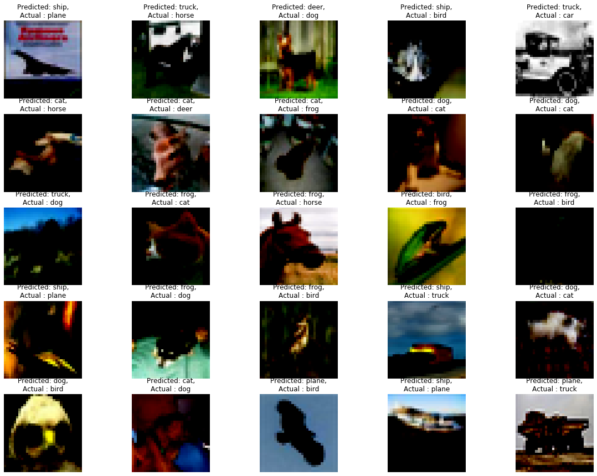
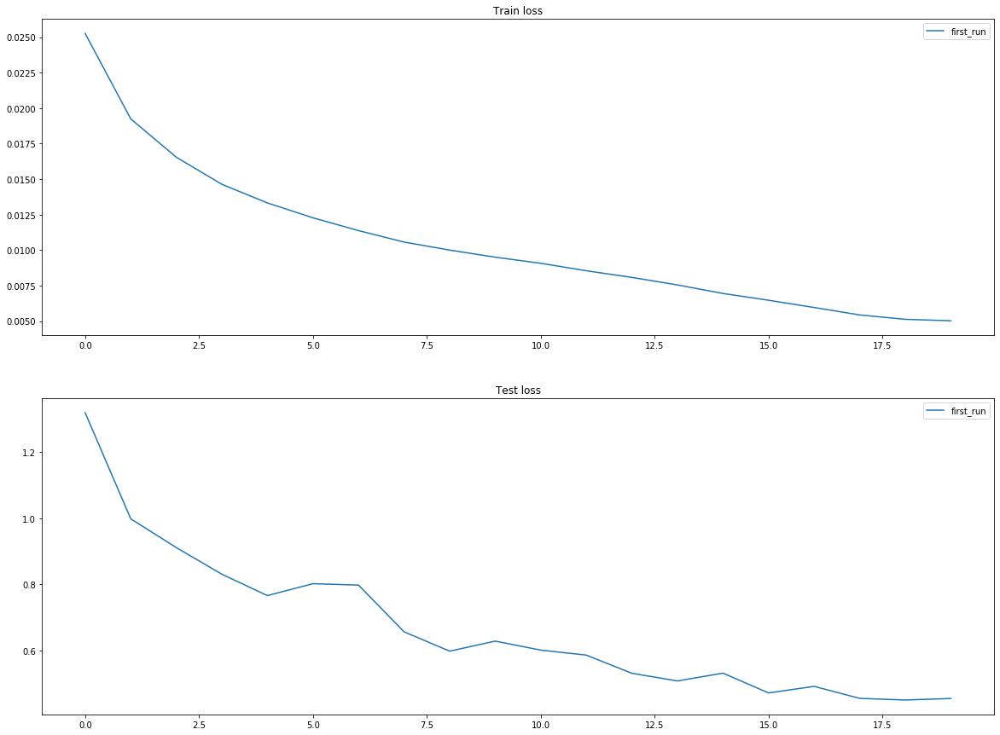

<h2 align = 'center'> Assignment 7</h2>

This week's assignment is to train a model to achieve > 80% percent validation accuracy on the `CIFAR10` dataset within the given constraints :- 

 * The model architecture should follow `ConvBlock` - `TransitionBlock` structure, and should have 3 Max Pooling operations.
 * One of the layers should use Depthwise Separable Convolution.
 * One of the layers should use Dialated Convolution. 
 * Total Parameters should be less than a Million.

<h2 align = 'center'> Project Structure </h2>

* [config.py](config.py) :- Contains constants used throughout the code. 
* [dataloader.py](data_loader.py) :- Contains `get_iterator` function that returns the train and test iterators for the `CIFAR10` dataset.

* [model.py](model.py) :- Contains the model along with the `Trainer` and `Trial` classes, which do most of the training and evaluation heavy lifting. The `Trainer` class contains code for model training, evaluation and custom code for identifying misclassified images from the test set. The `Trial` class serves as an entry point to model which encapsulates both model training and metric tracking (using the `Record` class). 
* [run.py](run.py) :- Contains code to train the model.

* [show_images_from_batch.py](show_images_from_batch.py) :- Contains code for visualizing the images from the `CIFAR10` dataset, as well as the correctly/incorrectly classified images.  

<h2 align = 'center'>  Model Architecture </h2>

The model is composed of three distinct Convolutional Blocks, with intermediary transition blocks that perfrom max pooling and 1x1 conv operation to reduce the number of kernels from the previous block to 32.

The first Conv block contains 2 regular convolution layers with a 3x3 kernel, with padding set to 1. Each convolution layer was followed by a `nn.ReLU`, `nn.BatchNorm2d` and `nn.Dropout` layers. This convolutional block takes in a tensor of size `[batch_size, 32, 32, 32]`, and returns a tensor of size `[batch_size, 128, 32, 32]`

The second Conv block contains 2 Atrous Convolution layers, with dialation set to 2. Atrous convolutions help capturing global context by performing convolutions over a larger area on the channels. This block should theoretically be placed first, but I got better results after placing it second. 

The third Conv block contains 3 Depthwise separable convolution layers. Depthwise Separable convolution allows similar performance as compared to regular convolutions, but with fewer number of parameters. 

Using `torch.nn.functional.nll_loss()` as my loss function, `SGD` as the optimizer and pytorch's `OneCycleLR` policy, the model was able to clear the target of 80% validation accuracy in the 11th epoch, and the final validation accuracy at the end of the 20th epoch was `84.95%`. 

<h2 align = 'center'>  Results </h2>

<h4 align = 'center'>   Correctly Classified Images </h4>

<h4 align = 'center'>   Incorrectly Classified Images </h4>

<h4 align = 'center'>   Training and Validation Accuracy </h4>

<h4 align = 'center'>   Training and Validation Loss </h4>

