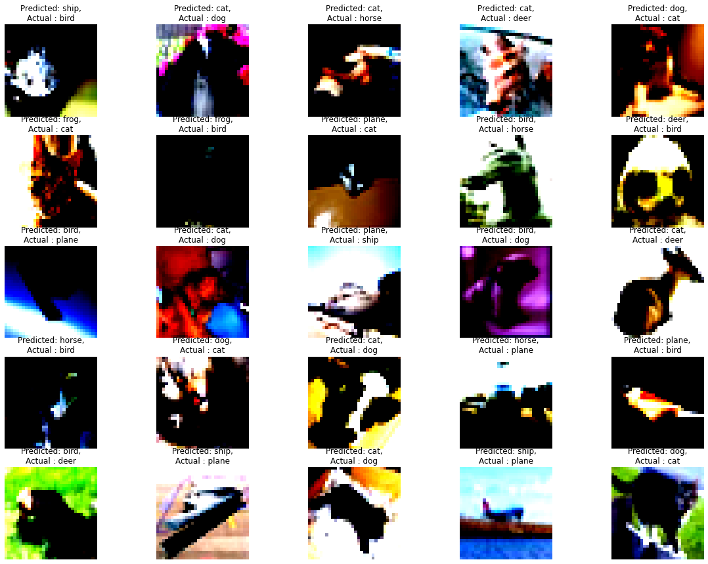
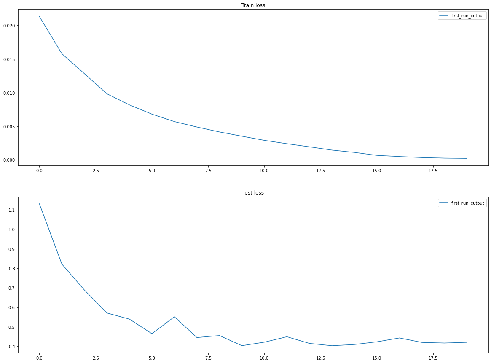

<h2 align ='center'> Assignment 8 </h2> 

### Final Training Accuracy :- 89.48%

### Transformations Used :
- Training :
    
    -  `torchvision.transforms.RandomRotation()`
    -  `torchvision.transforms.RandomHorizontalFlip()`
    -  `torchvision.transforms.ToTensor()`
    -  `torchvision.transforms.Normalize()`

- Test :
    -  `torchvision.transforms.ToTensor()`
    -  `torchvision.transforms.Normalize()`

<h2 align = 'center'> Results </h2>

<h4 align = 'center'>   Correctly Classified Images </h4>

<h4 align = 'center'>   Incorrectly Classified Images </h4>

<h4 align = 'center'>   Training and Test Accuracy </h4>

<h4 align = 'center'>   Training and Test Loss </h4>

<h2 align = 'center'> Training Logs </h2>

0%|          | 1/782 [00:00<02:22,  5.49it/s]
1 / 20
100%|██████████| 782/782 [01:42<00:00,  7.66it/s]
  3%|▎         | 4/157 [00:00<00:04, 33.93it/s]
 Training loss = 0.02104436792433262, Training Accuracy : 51.468
100%|██████████| 157/157 [00:04<00:00, 36.67it/s]
  0%|          | 1/782 [00:00<01:43,  7.51it/s]
 Test loss = 0.9579312722206116, Test Accuracy : 66.36
2 / 20
100%|██████████| 782/782 [01:41<00:00,  7.70it/s]
  3%|▎         | 4/157 [00:00<00:04, 38.12it/s]
 Training loss = 0.01522175781428814, Training Accuracy : 66.504
100%|██████████| 157/157 [00:04<00:00, 36.83it/s]
  0%|          | 1/782 [00:00<01:39,  7.82it/s]
 Test loss = 0.7728026418685913, Test Accuracy : 73.83
3 / 20
100%|██████████| 782/782 [01:40<00:00,  7.77it/s]
  3%|▎         | 4/157 [00:00<00:03, 38.31it/s]
 Training loss = 0.012013023719191551, Training Accuracy : 73.85
100%|██████████| 157/157 [00:04<00:00, 36.56it/s]
  0%|          | 1/782 [00:00<01:37,  8.00it/s]
 Test loss = 0.8193589548110962, Test Accuracy : 72.62
4 / 20
100%|██████████| 782/782 [01:41<00:00,  7.69it/s]
  3%|▎         | 4/157 [00:00<00:04, 37.30it/s]
 Training loss = 0.00939088873565197, Training Accuracy : 79.404
100%|██████████| 157/157 [00:04<00:00, 36.09it/s]
  0%|          | 1/782 [00:00<01:37,  8.01it/s]
 Test loss = 0.6986748643398285, Test Accuracy : 76.77
5 / 20
100%|██████████| 782/782 [01:42<00:00,  7.66it/s]
  3%|▎         | 4/157 [00:00<00:04, 37.40it/s]
 Training loss = 0.00758147519081831, Training Accuracy : 83.296
100%|██████████| 157/157 [00:04<00:00, 37.45it/s]
  0%|          | 1/782 [00:00<01:38,  7.92it/s]
 Test loss = 0.49392020478248594, Test Accuracy : 83.23
6 / 20
100%|██████████| 782/782 [01:42<00:00,  7.61it/s]
  3%|▎         | 4/157 [00:00<00:04, 34.66it/s]
 Training loss = 0.0063461135141551495, Training Accuracy : 86.16
100%|██████████| 157/157 [00:04<00:00, 35.95it/s]
  0%|          | 1/782 [00:00<01:46,  7.32it/s]
 Test loss = 0.5170641703128814, Test Accuracy : 82.77
7 / 20
100%|██████████| 782/782 [01:41<00:00,  7.70it/s]
  3%|▎         | 4/157 [00:00<00:04, 37.74it/s]
 Training loss = 0.0051800855435431, Training Accuracy : 88.61
100%|██████████| 157/157 [00:04<00:00, 34.91it/s]
  0%|          | 1/782 [00:00<01:47,  7.29it/s]
 Test loss = 0.5103466168880463, Test Accuracy : 83.08
8 / 20
100%|██████████| 782/782 [01:42<00:00,  7.60it/s]
  3%|▎         | 4/157 [00:00<00:04, 33.96it/s]
 Training loss = 0.004366494249552488, Training Accuracy : 90.362
100%|██████████| 157/157 [00:04<00:00, 36.33it/s]
  0%|          | 1/782 [00:00<01:37,  7.99it/s]
 Test loss = 0.48172497305870055, Test Accuracy : 84.44
9 / 20
100%|██████████| 782/782 [01:41<00:00,  7.67it/s]
  3%|▎         | 4/157 [00:00<00:04, 38.15it/s]
 Training loss = 0.003652523970231414, Training Accuracy : 91.97
100%|██████████| 157/157 [00:04<00:00, 37.11it/s]
  0%|          | 1/782 [00:00<01:46,  7.34it/s]
 Test loss = 0.48431796422004697, Test Accuracy : 84.97
10 / 20
100%|██████████| 782/782 [01:41<00:00,  7.70it/s]
  3%|▎         | 4/157 [00:00<00:04, 38.00it/s]
 Training loss = 0.0029689513612538576, Training Accuracy : 93.568
100%|██████████| 157/157 [00:04<00:00, 37.02it/s]
  0%|          | 1/782 [00:00<01:50,  7.06it/s]
 Test loss = 0.48929127616882323, Test Accuracy : 85.34
11 / 20
100%|██████████| 782/782 [01:42<00:00,  7.62it/s]
  3%|▎         | 4/157 [00:00<00:04, 33.68it/s]
 Training loss = 0.0023734301794320345, Training Accuracy : 94.794
100%|██████████| 157/157 [00:04<00:00, 36.72it/s]
  0%|          | 1/782 [00:00<01:39,  7.88it/s]
 Test loss = 0.454189829826355, Test Accuracy : 86.69
12 / 20
100%|██████████| 782/782 [01:42<00:00,  7.63it/s]
  3%|▎         | 4/157 [00:00<00:04, 37.38it/s]
 Training loss = 0.0018663684604689479, Training Accuracy : 95.92
100%|██████████| 157/157 [00:04<00:00, 35.37it/s]
  0%|          | 1/782 [00:00<01:39,  7.88it/s]
 Test loss = 0.4559980827331543, Test Accuracy : 87.15
13 / 20
100%|██████████| 782/782 [01:42<00:00,  7.64it/s]
  3%|▎         | 4/157 [00:00<00:04, 32.43it/s]
 Training loss = 0.0014946472365409136, Training Accuracy : 96.694
100%|██████████| 157/157 [00:04<00:00, 35.99it/s]
  0%|          | 1/782 [00:00<01:48,  7.19it/s]
 Test loss = 0.4848557709217072, Test Accuracy : 87.36
14 / 20
100%|██████████| 782/782 [01:42<00:00,  7.60it/s]
  3%|▎         | 4/157 [00:00<00:04, 35.94it/s]
 Training loss = 0.0010131753515452147, Training Accuracy : 97.828
100%|██████████| 157/157 [00:04<00:00, 36.57it/s]
  0%|          | 1/782 [00:00<01:40,  7.78it/s]
 Test loss = 0.4508515143871307, Test Accuracy : 88.18
15 / 20
100%|██████████| 782/782 [01:42<00:00,  7.64it/s]
  3%|▎         | 4/157 [00:00<00:04, 36.73it/s]
 Training loss = 0.000669208646286279, Training Accuracy : 98.59
100%|██████████| 157/157 [00:04<00:00, 36.08it/s]
  0%|          | 1/782 [00:00<01:46,  7.35it/s]
 Test loss = 0.5016263261318207, Test Accuracy : 87.86
16 / 20
100%|██████████| 782/782 [01:42<00:00,  7.63it/s]
  3%|▎         | 4/157 [00:00<00:04, 34.18it/s]
 Training loss = 0.00040042714681476355, Training Accuracy : 99.224
100%|██████████| 157/157 [00:04<00:00, 35.45it/s]
  0%|          | 1/782 [00:00<01:38,  7.90it/s]
 Test loss = 0.47793337631225585, Test Accuracy : 88.64
17 / 20
100%|██████████| 782/782 [01:42<00:00,  7.61it/s]
  3%|▎         | 4/157 [00:00<00:04, 36.27it/s]
 Training loss = 0.0002127785119228065, Training Accuracy : 99.582
100%|██████████| 157/157 [00:04<00:00, 35.78it/s]
  0%|          | 1/782 [00:00<01:46,  7.32it/s]
 Test loss = 0.49054302978515624, Test Accuracy : 89.16
18 / 20
100%|██████████| 782/782 [01:42<00:00,  7.66it/s]
  3%|▎         | 4/157 [00:00<00:03, 38.42it/s]
 Training loss = 0.0001295374968321994, Training Accuracy : 99.808
100%|██████████| 157/157 [00:04<00:00, 37.14it/s]
  0%|          | 1/782 [00:00<01:38,  7.89it/s]
 Test loss = 0.4849599668979645, Test Accuracy : 89.37
19 / 20
100%|██████████| 782/782 [01:42<00:00,  7.63it/s]
  3%|▎         | 4/157 [00:00<00:04, 36.10it/s]
 Training loss = 9.461209992878139e-05, Training Accuracy : 99.84
100%|██████████| 157/157 [00:04<00:00, 34.31it/s]
  0%|          | 1/782 [00:00<01:57,  6.67it/s]
 Test loss = 0.48257704219818115, Test Accuracy : 89.55
20 / 20
100%|██████████| 782/782 [01:42<00:00,  7.61it/s]
  3%|▎         | 4/157 [00:00<00:04, 36.95it/s]
 Training loss = 7.717860717093572e-05, Training Accuracy : 99.902
100%|██████████| 157/157 [00:04<00:00, 37.04it/s]
 Test loss = 0.48242829642295837, Test Accuracy : 89.48